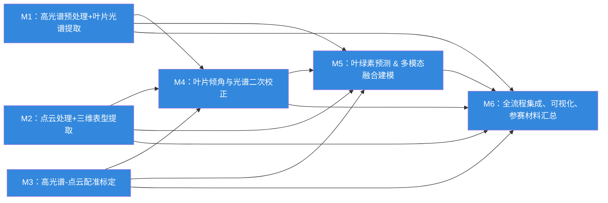

**title**
~~font~~
==font==
`import numpy as np`

- num1
    - num2

1. first
2. second

- [x]
- [ ]
> reference
>> reference 2

---

***

```mermaid
graph LR
    classDef task fill:#3388dd,color:white

    N1["M1：高光谱预处理+叶片光谱提取"]:::task
    N2["M2：点云处理+三维表型提取"]:::task
    N3["M3：高光谱-点云配准标定"]:::task
    N4["M4：叶片倾角与光谱二次校正"]:::task
    N5["M5：叶绿素预测 & 多模态融合建模"]:::task
    N6["M6：全流程集成、可视化、参赛材料汇总"]:::task

    N1 --> N4
    N2 --> N4
    N3 --> N4

    N1 --> N5
    N2 --> N5
    N3 --> N5
    N4 --> N5

    N1 --> N6
    N2 --> N6
    N3 --> N6
    N4 --> N6
    N5 --> N6

```